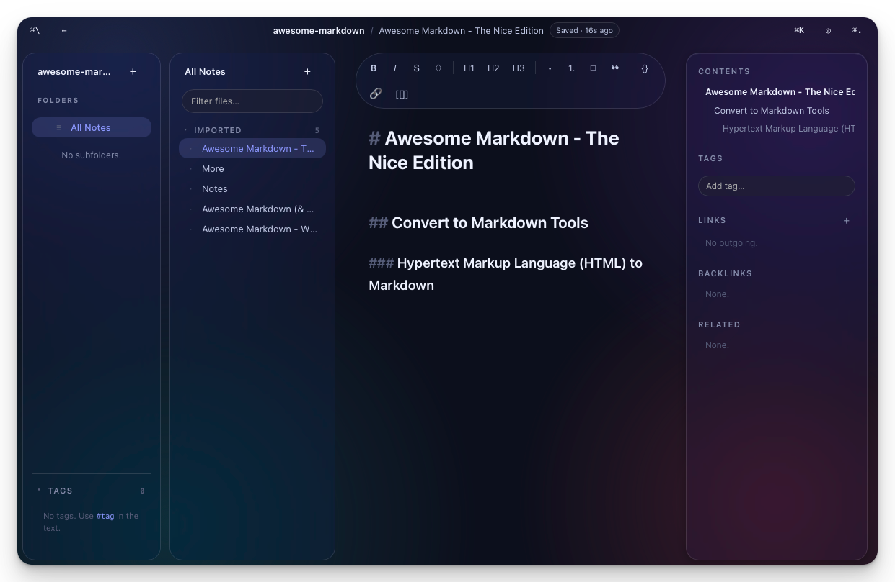

# Kumar Notes

**A lightweight, local-first note-taking & documentation app.**
Your notes stay as plain Markdown files on your disk — no accounts, no cloud, no lock-in.

---

## ✨ Features

- 📝 **Markdown editor** — tables, code blocks, task lists, callouts
- 🔗 **Wiki links** — connect notes with `[[page-name]]`, see backlinks & related docs
- 🗂️ **Smart sidebar** — auto-organized folders, time lanes (Today, This Week, …)
- 🔍 **Instant search** — full-text search + `⌘K` command palette to jump anywhere
- 🏷️ **Tags** — `#tag` in the text or in YAML frontmatter
- 🎯 **Focus mode** — hide the panels and just write
- 🌗 **Light & dark** — follows your system theme
- 💾 **Plain files** — every note is a `.md` file you fully own

## 🚀 Get Started

Grab the latest build from the [Releases](../../releases) page, open it, and pick a folder
to use as your workspace. That folder's `.md` files become your notes — existing Markdown
folders work out of the box.

> Workspaces are just regular folders. Kumar only adds a small `.kumar/` directory for its
> search index. Move, back up, or sync your notes however you like.

## 💻 Downloads

Prebuilt for **macOS (Apple Silicon)**. Grab the latest `.dmg` from the
[Releases](../../releases) page, verify it against the published checksum, then
drag Kumar Notes into your Applications folder.

## ☕ Buy Me a Coffee

Kumar Notes is free and built in my spare time. If it makes your day a little calmer,
consider supporting development:

## 📄 License

This project is closed-source freeware.
Source code is not publicly available.

Free to use for personal and commercial purposes. Modification, reverse
engineering, redistribution, and resale are not permitted — see [LICENSE](LICENSE).
